# Restaurant Management REST API

A RESTful API built with **Node.js, Express.js, and MongoDB** for managing restaurant waiters and customer orders. The project implements secure JWT authentication, protected routes, and complete CRUD functionality.

## Task Requirements

| Requirement                           |       Status       |
| ------------------------------------- | :----------------: |
| GitHub repository with REST API       |          ✅         |
| CRUD REST API using Express           |          ✅         |
| Mongoose Schemas & Models             |          ✅         |
| JWT Authentication (Register & Login) |          ✅         |
| Authentication Middleware             |          ✅         |
| Error Handling Middleware             |          ✅         |
| At Least Two Resources                | ✅ Waiters & Orders |

---

## Tech Stack

* Node.js
* Express.js
* MongoDB Atlas
* Mongoose
* JWT (jsonwebtoken)
* bcryptjs
* dotenv
* Thunder Client

---

## API Endpoints

### Authentication

* `POST /api/auth/register`
* `POST /api/auth/login`

### Waiters

* `POST /api/waiters`
* `GET /api/waiters`
* `GET /api/waiters/:id`
* `PUT /api/waiters/:id`
* `DELETE /api/waiters/:id`

### Orders

* `POST /api/orders`
* `GET /api/orders`
* `GET /api/orders/:id`
* `PUT /api/orders/:id`
* `DELETE /api/orders/:id`

---

## Testing

All API endpoints were tested successfully using **Thunder Client**.

---

## Screenshots

* Server Running
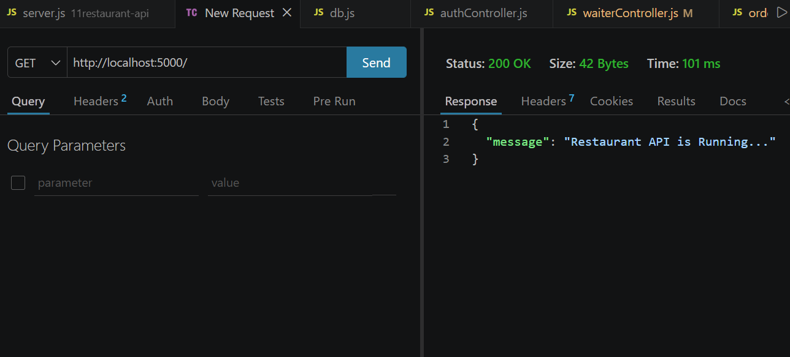
* User Registration
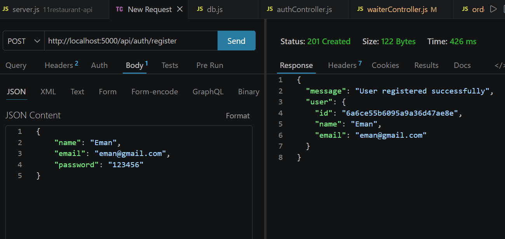
* User Login
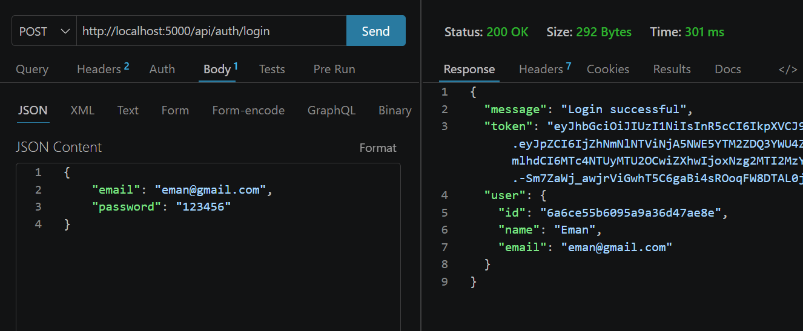
* Create Waiter
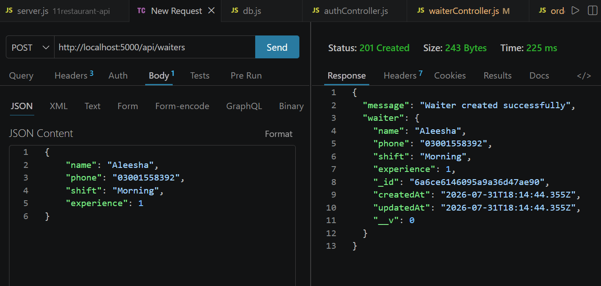
* Get All Waiters
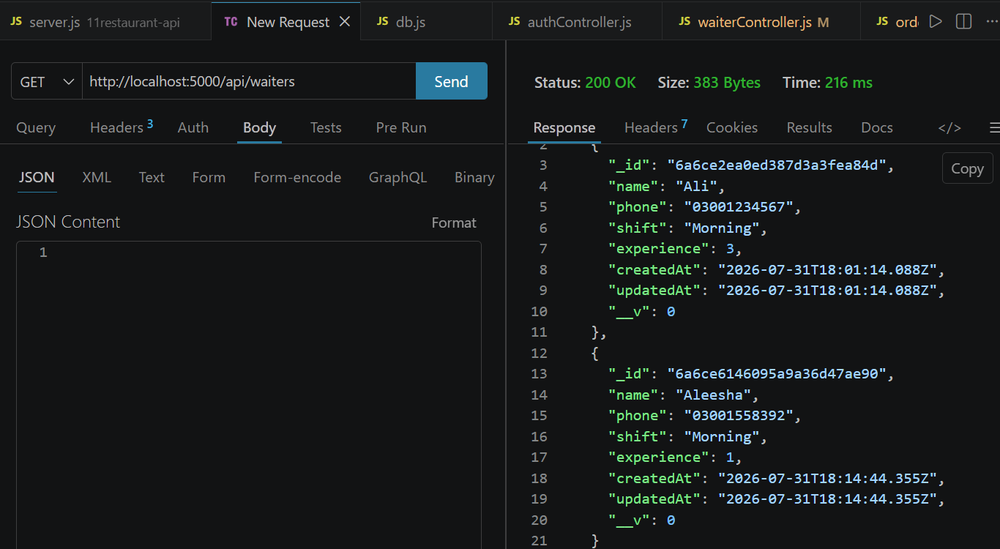
* Update Waiter
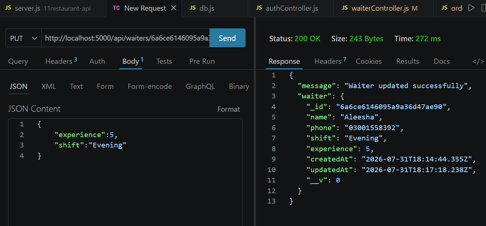
* Delete Waiter
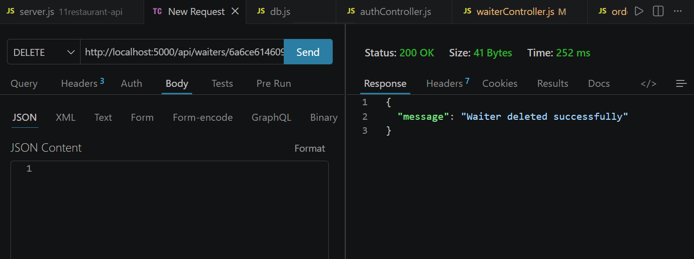
* Create Order
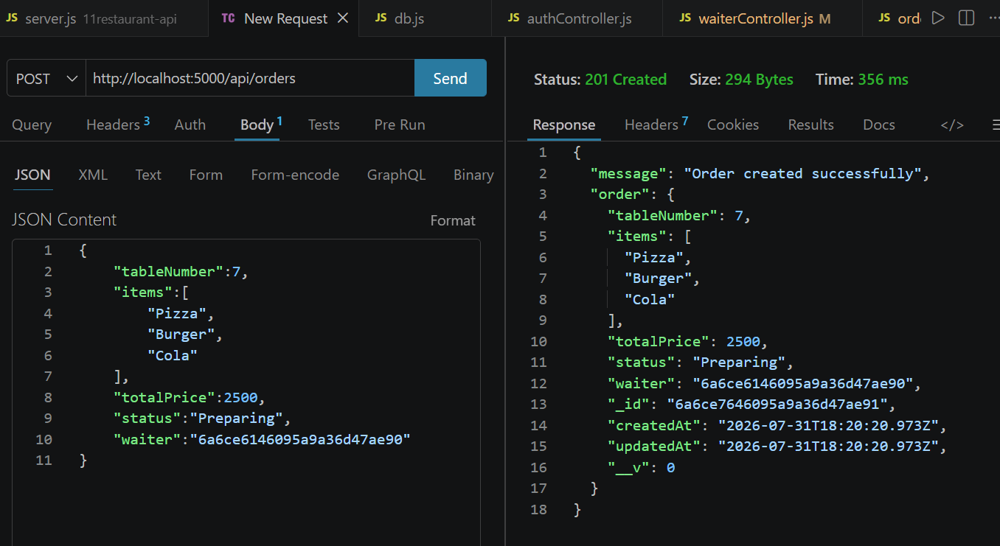
* Get All Orders
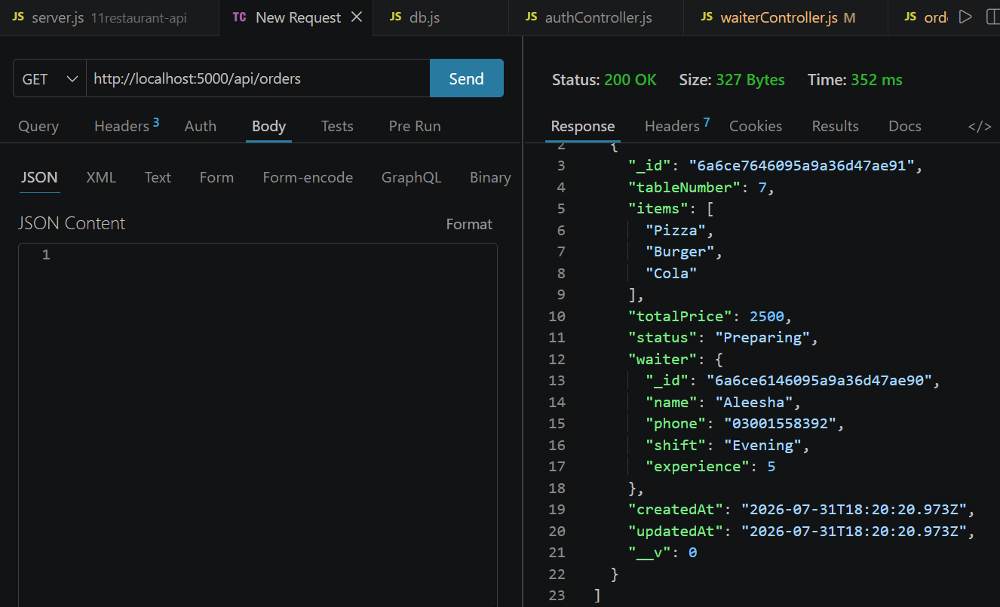
* Update Order
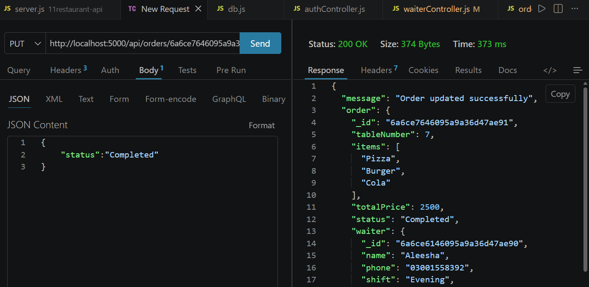
* Delete Order
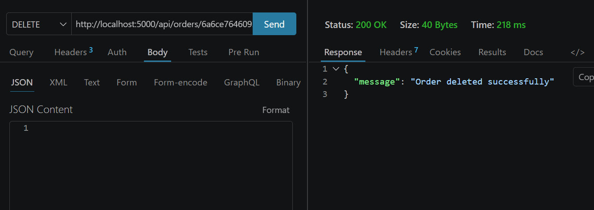
* Unauthorized Request
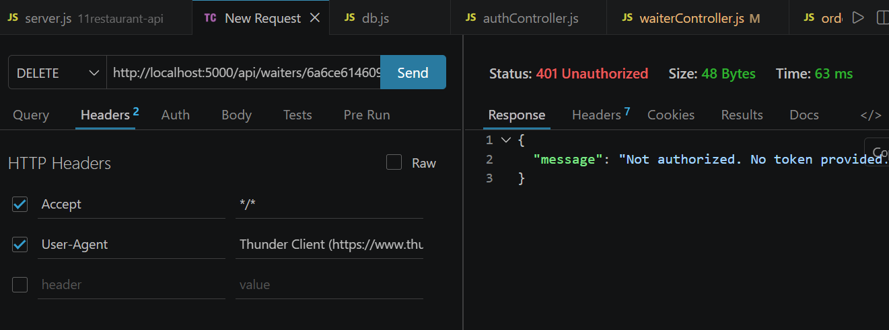

---

## Learning Outcomes

This project strengthened my understanding of REST API development with Express.js, MongoDB using Mongoose, JWT authentication, middleware, CRUD operations, and API testing with Thunder Client.
